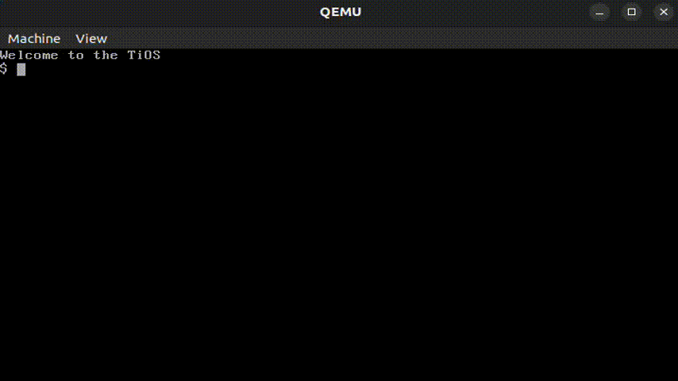
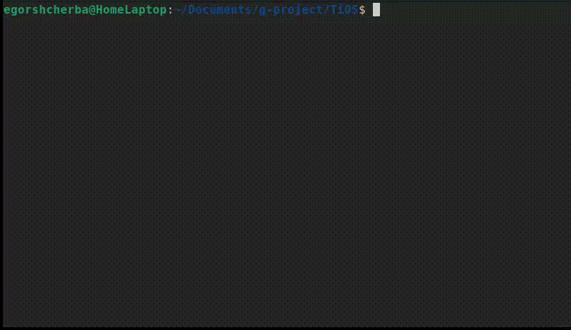

# TiOS
__TiOS__ - Маленькая операционная система, полностью написанная на языке ассемблер (nasm) для процессоров x64_86 работающая в реальном режиме. Реализована с использованием функций BIOS и кастомной плоской файловой системой, пользовательские программы - это обычные бинарные файлы. По своей архитектуре ОС напоминает DOS ранних версий.

Является первой ОС из серии руководств по программированию операционных систем. В процессе чтения руководства вы познакомитесь с архитектурой процессора x64-86 и с его основными командами, о работе в реальном режиме процессора, узнаете об этапах загрузки ОС на пк с BIOS. Так же познакомитесь с файловыми системами и работе блочных устройств. В конце чтения руководства вы реализуете данную ОС вместе с утилитой для создания образа диска с плоской файловой системой.

 __P.S :: отсутствие руководства в папке /doc репозитория, означает что я работаю над реализациями других микро ос для следующих частей руководств. Как оказалось, написание самих микро ос напомного проще чем руководств.__   

## DEMO


## Установка зависимостей.
```bash
# пример в среде debian/ubuntu
sudo apt install qemu      # эмулятор qemu
sudo apt install nasm      # ассемблер nasm
```

## Структура проекта.
```
  -bin
    директория содержит пользовательские программы.
  -doc
    обучающее руководство.
  -sys
    исходные файлы загрузчика boot.asm и ядрая kernel.asm
  -tools
    исходные файлы утилиты для создание образа плоской файловой системы.
```

## Компиляция и запуск.
```bash
make tools  # компиляция утилиты для создания образа диска.
make        # компиляция и создания образа диска.
make qemu   # запустить ос в эмуляторе qemu.
```

## Интерфейс ОС.
__TiOS__ - не графическая ОС, в принципе, как и все другие ОС из других частей. В данной ОС оболочка командой строки встроена непосредственно в ядро ОС и поддерживает следующие команды:
```
  $ list        # отобразить список файлов.
  $ run [name]  # загрузить и запустить бинарный файл.
  $ date        # отобразить текущую дату.
  $ time        # отобразить текущее время.
  $ infosys     # информация о системе.
  $ reboot      
  $ shutdown
  $ clear       # или CTR+L, очистка экрана.
```

## Создание пользовательских программ.
Пользовательские программы должны находится в папке /bin и иметь расширение *.asm После чего утилита make при перекомпиляции автоматически скомпилирует и загрузит на образ все пользовательские программы из данной директории, но в самой ос скомпилированный файл уже будет без расширения. Например, demo.asm после компиляции на самом образе диска будет называться demo  



##  Список функций прерывания 0x21:
```asm
  # ВЫХОД В ОС
  # INT 0x21 ИЛИ INT 0x20 (БЕЗ АРГУМЕНТОВ)
  # ВХОД:
  #   AH = 0
  # ВЫВОД
  #   ОТСУТСТВУЕТ
  #########################################

  # ПРОЧИТАТЬ СИМВОЛ С КЛАВИАТУРЫ
  # INT 0x21 
  # ВХОД:
  #   AH = 0x1
  # ВЫВОД:
  #   AH - сканкод, AL - аски код.
  #########################################

  # ВЫВЕСТИ СИМВОЛ НА ЭКРАН
  # INT 0x21
  # ВХОД:
  #   AH = 0x2
  #   AL = аски код выводимого символа.
  # ВЫВОД:
  #   
  #########################################

  # ПРОЧИТАТЬ СИМВОЛ В РЕЖИМЕ ЭХО
  # INT 0x21
  # ВХОД:
  #   AH = 0x3
  #   ES:DI  - указатель на буфер
  #   CX     - размер буфера
  # ВЫВОД:
  #   ES:DI  - в буфере прочитаные символы
  #########################################

  # ВЫВЕСТИ СТРОКУ НА ЭКРАН
  # INT 0x21
  # ВХОД:
  #   AH = 0x4
  #   DS:SI - указатель на строку, оканчивающую на ноль.
  # ВЫВОД
  #   ОТСУТСТВУЕТ
  #########################################
```